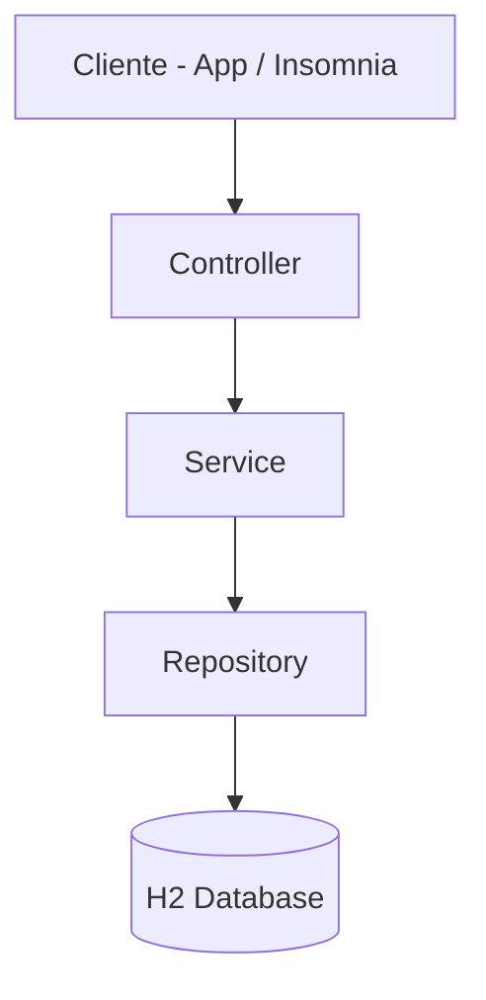
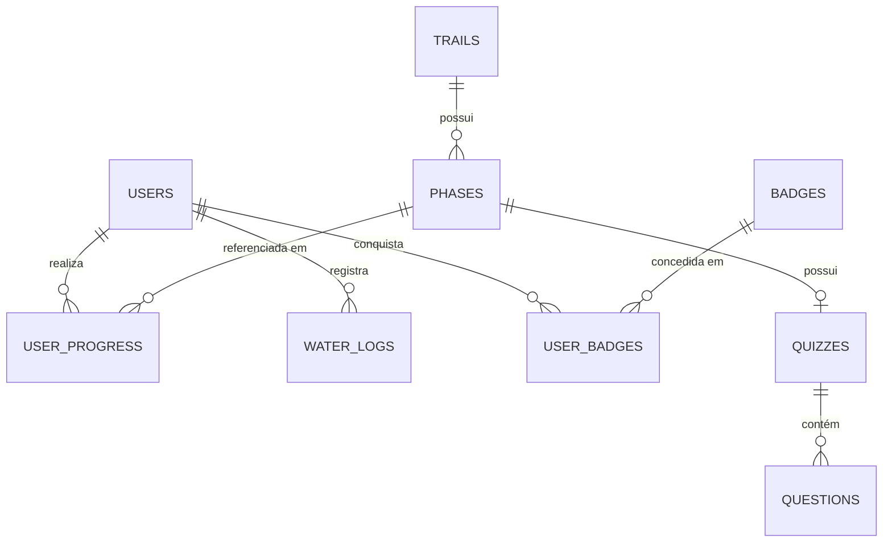
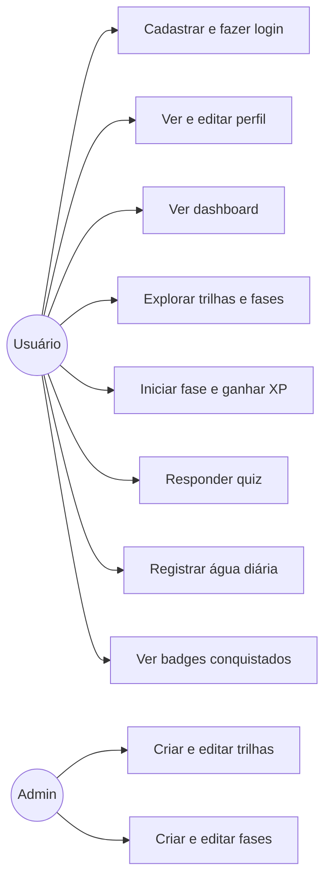

# WellMe – CarePlus API

API REST para o aplicativo mobile gamificado de saúde **WellMe** (CarePlus).  
Permite gerenciar usuários, trilhas de aprendizagem, quizzes, progresso, hidratação e badges.

**FIAP – Engenharia de Software | 3ESPR – Sprint 3: SOA & WebServices 2026**

---

## Stack

| Camada       | Tecnologia                           |
|---|--------------------------------------|
| Linguagem    | Java 20                              |
| Framework    | Spring Boot 3.3.5                    |
| Persistência | Spring Data JPA + H2 (in-memory)     |
| Migrações    | Flyway                               |
| Segurança    | Spring Security + JWT (jjwt 0.12.7)  |
| Validação    | Jakarta Bean Validation              |
| Docs         | SpringDoc OpenAPI 2.6.0 (Swagger UI) |
| Build        | Maven 3.x                            |

---

## Como executar

**Pré-requisitos:** Java 21 e Maven 3.8+

```bash
cd wellme-api
./mvnw spring-boot:run
```

Aplicação disponível em: **http://localhost:8080**

---

## Banco de Dados (H2 in-memory)

| Item | Valor |
|---|---|
| Console H2 | http://localhost:8080/h2-console |
| JDBC URL | `jdbc:h2:mem:wellme` |
| Usuário | `sa` |
| Senha | *(vazio)* |

### Migrações Flyway

| Arquivo | Conteúdo |
|---|---|
| `V1__init.sql` | Tabelas: users, trails, phases, quizzes, questions, user_progress, water_logs, badges, user_badges |
| `V2__seed.sql` | 5 trilhas, 3 fases, 1 quiz com 5 questões, 8 badges |

---

## Autenticação

**GETs são públicos.** Cadastro de usuário é público.  
Operações de escrita exigem token JWT no header `Authorization: Bearer <token>`.

```bash
# Obter token (usuário padrão do sistema)
curl -X POST http://localhost:8080/auth/login \
  -H "Content-Type: application/json" \
  -d '{"username":"admin","password":"123456"}'
# → {"token":"eyJ..."}

# Cadastrar e usar usuário próprio
curl -X POST http://localhost:8080/api/v1/users/register \
  -H "Content-Type: application/json" \
  -d '{"name":"Maria","email":"maria@email.com","password":"senha1234"}'
```

---

## Documentação Swagger

**http://localhost:8080/swagger-ui.html**

---

## Endpoints

### Auth
| Método | Endpoint | Descrição | Auth |
|---|---|---|---|
| POST | `/auth/login` | Gerar token JWT | Não |

### Usuários `/api/v1/users`
| Método | Endpoint | Descrição | Auth |
|---|---|---|---|
| GET | `/api/v1/users` | Listar usuários | Não |
| GET | `/api/v1/users/{id}` | Buscar por ID | Não |
| POST | `/api/v1/users/register` | Cadastro (e-mail único, senha ≥ 8 chars) | Não |
| PUT | `/api/v1/users/{id}` | Editar perfil (nome, foto, meta água) | Sim |
| DELETE | `/api/v1/users/{id}` | Remover usuário | Sim |
| GET | `/api/v1/users/{id}/dashboard` | Dashboard XP/nível/fases/badges/água | Não |

### Trilhas & Fases `/api/v1/trails`
| Método | Endpoint | Descrição | Auth |
|---|---|---|---|
| GET | `/api/v1/trails` | Trilhas ativas | Não |
| GET | `/api/v1/trails/all` | Todas as trilhas (incl. inativas) | Sim |
| GET | `/api/v1/trails/{id}` | Trilha por ID | Não |
| POST | `/api/v1/trails` | Criar trilha | Sim |
| PUT | `/api/v1/trails/{id}` | Atualizar trilha | Sim |
| DELETE | `/api/v1/trails/{id}` | Desativar trilha | Sim |
| GET | `/api/v1/trails/{trailId}/phases` | Fases da trilha | Não |
| GET | `/api/v1/trails/phases/{id}` | Fase por ID | Não |
| POST | `/api/v1/trails/phases` | Criar fase | Sim |
| PUT | `/api/v1/trails/phases/{id}` | Atualizar fase | Sim |
| DELETE | `/api/v1/trails/phases/{id}` | Remover fase | Sim |

### Quizzes `/api/v1/quizzes`
| Método | Endpoint | Descrição | Auth |
|---|---|---|---|
| GET | `/api/v1/quizzes/{quizId}` | Quiz por ID (sem gabaritos) | Não |
| GET | `/api/v1/quizzes/phase/{phaseId}` | Quiz da fase (sem gabaritos) | Não |
| POST | `/api/v1/quizzes/{quizId}/submit` | Submeter respostas → score + XP + badges | Sim |

### Progresso `/api/v1/progress`
| Método | Endpoint | Descrição | Auth |
|---|---|---|---|
| GET | `/api/v1/progress/user/{userId}` | Todo o progresso do usuário | Não |
| GET | `/api/v1/progress/user/{userId}/phase/{phaseId}` | Progresso em fase específica | Não |
| POST | `/api/v1/progress/start?userId=&phaseId=` | Iniciar fase (IN_PROGRESS + XP base) | Sim |

### Hidratação `/api/v1/water`
| Método | Endpoint | Descrição | Auth |
|---|---|---|---|
| POST | `/api/v1/water/user/{userId}/log` | Registrar consumo (ml) | Sim |
| GET | `/api/v1/water/user/{userId}/summary?date=` | Resumo diário vs meta | Não |
| GET | `/api/v1/water/user/{userId}/history` | Histórico completo | Não |
| DELETE | `/api/v1/water/user/{userId}/log/{logId}` | Remover registro | Sim |

### Badges `/api/v1/badges`
| Método | Endpoint | Descrição | Auth |
|---|---|---|---|
| GET | `/api/v1/badges` | Todos os badges do sistema | Não |
| GET | `/api/v1/badges/user/{userId}` | Badges conquistados pelo usuário | Não |

---

## Exemplos cURL

### Cadastrar usuário
```bash
curl -X POST http://localhost:8080/api/v1/users/register \
  -H "Content-Type: application/json" \
  -d '{"name":"João Silva","email":"joao@email.com","password":"minhasenha1"}'
```

### Ver dashboard do usuário
```bash
curl http://localhost:8080/api/v1/users/{id}/dashboard
```

### Iniciar uma fase (ganha XP da fase)
```bash
curl -X POST "http://localhost:8080/api/v1/progress/start?userId={uid}&phaseId=ph-hidr-001" \
  -H "Authorization: Bearer <TOKEN>"
```

### Registrar consumo de água
```bash
curl -X POST http://localhost:8080/api/v1/water/user/{userId}/log \
  -H "Content-Type: application/json" \
  -H "Authorization: Bearer <TOKEN>" \
  -d '{"amountMl":300}'
```

### Buscar quiz da fase de hidratação
```bash
curl http://localhost:8080/api/v1/quizzes/phase/ph-hidr-001
```

### Submeter respostas do quiz
```bash
curl -X POST http://localhost:8080/api/v1/quizzes/qz-hidr-001/submit \
  -H "Content-Type: application/json" \
  -H "Authorization: Bearer <TOKEN>" \
  -d '{
    "userId": "{userId}",
    "answers": {
      "qq-h001-1": "C",
      "qq-h001-2": "C",
      "qq-h001-3": "B",
      "qq-h001-4": "C",
      "qq-h001-5": "C"
    }
  }'
```

---

## Payload de Erro Padrão

```json
{
  "timestamp": "2026-05-08T10:30:00",
  "status": 404,
  "error": "Not Found",
  "message": "Usuário não encontrado: abc-123",
  "path": "/api/v1/users/abc-123"
}
```

---

## Regras de Negócio

| Regra | HTTP |
|---|---|
| E-mail único no cadastro | 409 DuplicateEmailException |
| Senha mínimo 8 caracteres | 400 (Bean Validation) |
| Quiz só pode ser submetido após iniciar a fase | 404 |
| Quiz não pode ser submetido mais de uma vez | 409 QuizAlreadySubmittedException |
| Respostas devem ser A, B, C ou D | 400 InvalidAnswerException |
| XP = xpReward × (score/100), arredondado | — |
| Nível = (XP total / 100) + 1 | — |
| Badges concedidos automaticamente após quiz/progresso | — |

---

## Sistema de Gamificação

### XP e Níveis
- Iniciar fase → XP base da fase (ex: 15 XP)
- Completar quiz → XP proporcional ao score (ex: 25 XP × 80% = 20 XP)
- Nível sobe a cada 100 XP acumulados

### Badges automáticos
| Badge | Critério |
|---|---|
| Primeira Fase | Completar 1 fase |
| Quiz Master | Score 100% em qualquer quiz |
| Nível 5 | Atingir level ≥ 5 |
| Dedicado | Completar 10 fases |
| Explorador | Iniciar fases em ≥ 3 trilhas |

---

## Decisões de Arquitetura (ADRs)

**ADR-1: Arquitetura 3 Camadas (MVC)**  
Controller → Service (regras de negócio) → Repository (acesso a dados via Spring Data JPA).  
DTOs separados para entrada e saída. Mappers manuais sem framework externo.

**ADR-2: H2 + Flyway**  
`ddl-auto=none` com migrações versionadas garante rastreabilidade e portabilidade.  
Para usar MySQL/PostgreSQL: alterar datasource no `application.properties` e ajustar Flyway dialect.

**ADR-3: Gabarito não exposto**  
O campo `correctOption` das questões não é incluído no `QuestionResponseDTO`.  
A correção acontece integralmente no servidor (QuizService), sem expor as respostas ao cliente.

**ADR-4: Concessão automática de badges**  
Após cada submissão de quiz, o `BadgeService.checkAndAwardBadges()` é invocado  
para verificar e conceder badges elegíveis de forma automática e idempotente.

---

# Diagramas
 
---

## 1. Arquitetura em Camadas


 
---

## 2. Diagrama de Entidades ER


 
---

## 3. Casos de Uso


 
---
 